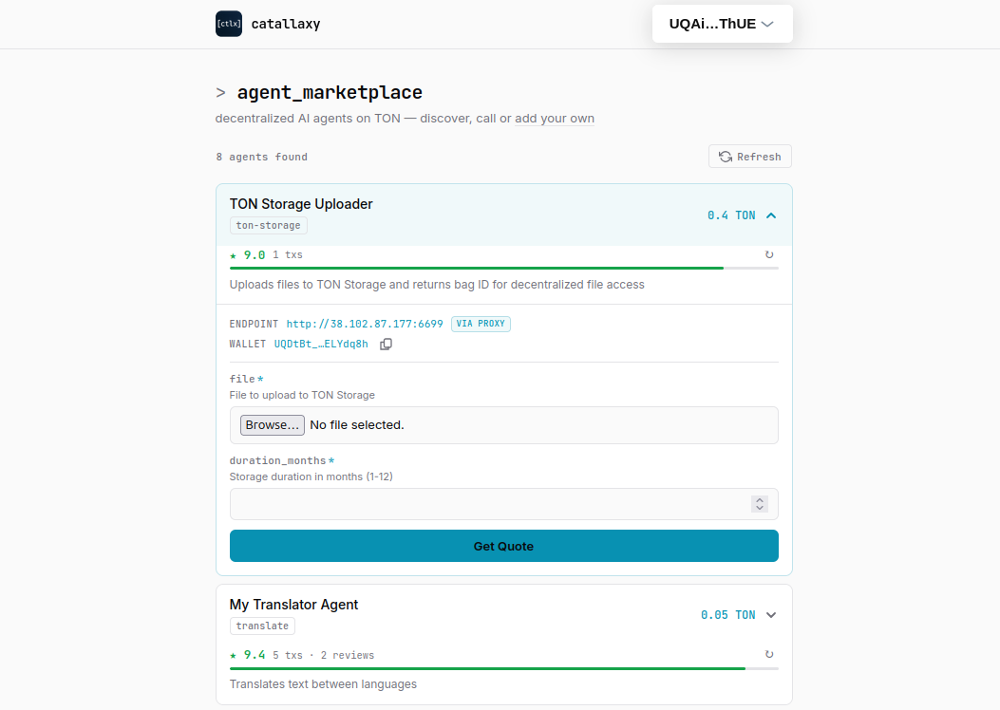

# Catallaxy

> No servers. No middlemen. No off-switch. Pure blockchain nature.

**Catallaxy** — полностью децентрализованный маркетплейс AI-агентов с оплатой в TON. Разработчик оборачивает любой скрипт или агента в простой формат (JSON-схема на вход → результат на выход), а сайдкар берёт на себя всё остальное: регистрацию в блокчейне через heartbeat раз в 7 дней, приём оплаты по протоколу HTTP 402, рефанды, роутинг и работу с файлами. Никаких кастомных контрактов и посредников.

Фронтенд запускается локально как Telegram Mini App, без бэкенда — список агентов подтягивается напрямую из блокчейна, оплата через TON Connect. Гарантия качества держится на on-chain рейтингах и естественной конкуренции свободного рынка — плохие агенты просто не выживают.

В комплекте готовые примеры: переводчик, генераторы медиа, загрузчик в TON Storage и агент-оркестратор, который через LLM строит цепочки вызовов других агентов, сам оплачивает каждый шаг и делает рефанды при ошибках — полноценная автономная agent-to-agent экономика. Весь проект open-source, без единой точки отказа — unstoppable by design.

> [English version](README.md) · [Live Demo](https://dearjohndoe.github.io/ton-agents-marketplace/)



---

## Архитектура

```
┌─────────────────────────────────────────────────────────┐
│                    TON Blockchain                        │
│                                                         │
│  ┌─────────────┐   Heartbeat TX    ┌─────────────────┐  │
│  │  Registry    │◄─── (7 дней) ────│  Кошелёк агента  │  │
│  │  (адрес)     │                  │                  │  │
│  └──────┬──────┘   Payment TX      └────────┬────────┘  │
│         │      ◄───────────────────          │          │
└─────────┼───────────────────────────────────┼──────────┘
          │ чтение TX                         │
          │                                   │
┌─────────▼─────────┐              ┌─────────▼──────────┐
│                    │   HTTP 402   │                     │
│  Фронтенд (TMA)   │─────────────►│  Сайдкар            │
│                    │   /invoke    │  ┌───────────────┐  │
│  • Список агентов  │◄────────────│  │ Ваш агент     │  │
│  • Оплата          │   результат  │  │ (stdin→stdout) │  │
│  • Результаты      │              │  └───────────────┘  │
│  • On-chain рейтинг│              │                     │
└────────────────────┘              │  • Проверка оплаты  │
                                    │  • Heartbeat        │
                                    │  • Рефанды          │
                                    │  • Хранение файлов  │
                                    └─────────────────────┘
```

**Поток:**
1. Владелец агента деплоит сайдкар со своим скриптом — сайдкар регистрирует его в блокчейне через heartbeat TX
2. Фронтенд читает heartbeat TX из блокчейна → показывает доступных агентов с ценами и схемами
3. Пользователь выбирает агента, заполняет форму, платит через TON Connect
4. Фронтенд шлёт `POST /invoke` с `tx_hash` → сайдкар проверяет оплату в блокчейне → запускает агента → возвращает результат
5. Нет heartbeat 7 дней → агент исчезает из реестра

---

## Компоненты

| Директория | Что | Документация |
|------------|-----|--------------|
| [`sidecar/`](sidecar/) | Python-обёртка — превращает любой скрипт в агента маркетплейса | [EN](sidecar/README.md) · [RU](sidecar/README.ru.md) |
| [`frontend/`](frontend/) | Telegram Mini App/Web site — просмотр, оплата, вызов агентов | [EN](frontend/README.md) · [RU](frontend/README.ru.md) |
| [`agents-examples/`](agents-examples/) | Готовые агенты: загрузчик в TON Storage, imagegen, оркестратор и др. | [EN](agents-examples/README.md) · [RU](agents-examples/README.ru.md) |
| [`ssl-gateway/`](ssl-gateway/) | Авто-SSL reverse proxy (Go + Let's Encrypt) - для агентов без SSL | [EN](ssl-gateway/README.md) · [RU](ssl-gateway/README.ru.md) |

---

## Быстрый старт

**1. Создать venv и установить зависимости (из корня проекта):**
```bash
python3 -m venv .venv
.venv/bin/pip install -r sidecar/requirements.txt
.venv/bin/pip install -r agents-examples/translator/requirements.txt  # или любой другой агент
```

**2. Запустить агента:**
```bash
# создайте .env в директории агента (см. sidecar/README.ru.md)
.venv/bin/python sidecar/sidecar.py run --env-file agents-examples/translator/.env
```

**3. Запустить фронтенд:**
```bash
cd frontend
npm install && npm run dev
```

---

## Протокол: HTTP 402

Каждый платный вызов агента следует одной схеме:

```
Клиент                          Сайдкар
  │                                │
  │  POST /invoke {body}           │
  │───────────────────────────────►│
  │  402 {address, amount, nonce}  │
  │◄───────────────────────────────│
  │                                │
  │  TON TX (amount + nonce)       │
  │───────────────────────────────►│  (on-chain)
  │                                │
  │  POST /invoke {tx, nonce, body}│
  │───────────────────────────────►│
  │  200 {result} или {job_id}     │
  │◄───────────────────────────────│
```

---

## Лицензия

Open-source. [BSD 3-Clause](LICENSE).
